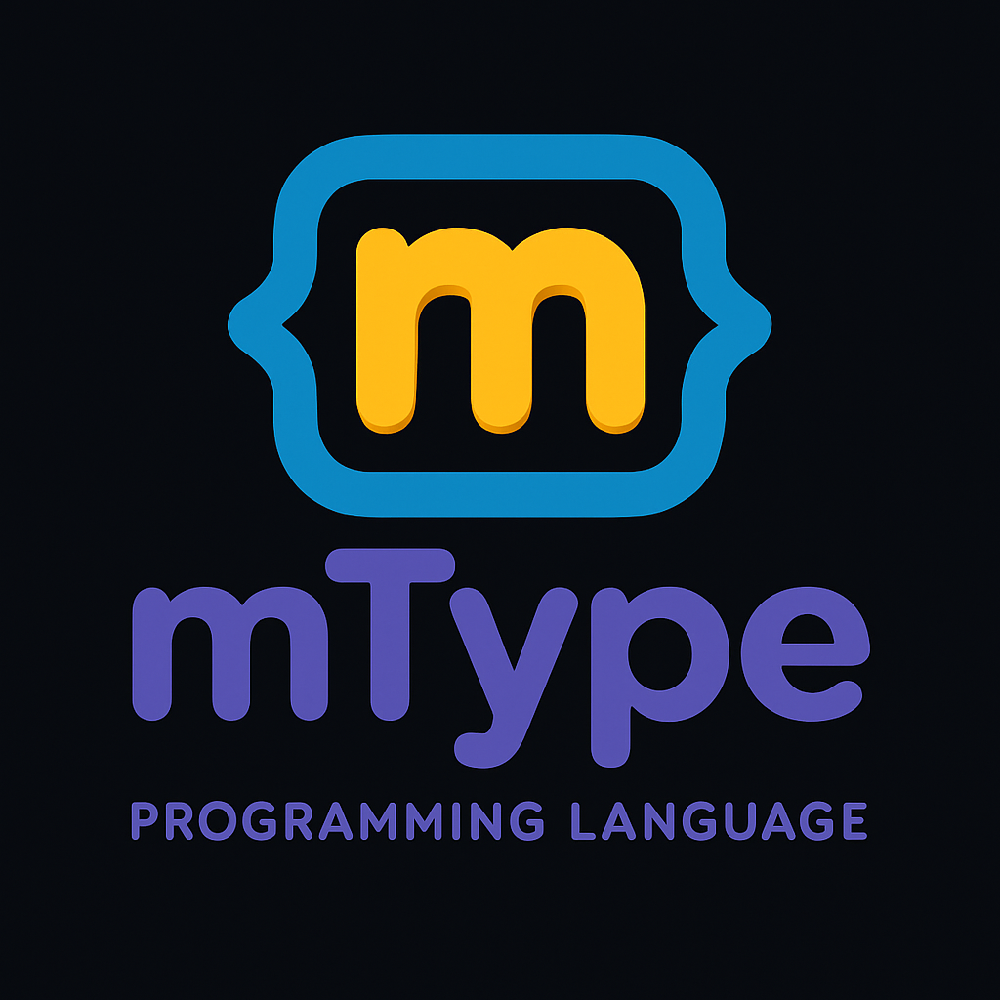

<div align="center">
  
</div>

# mType Programming Language


[](https://github.com/matan45/mType/actions/workflows/ci.yml)


mType is a statically typed, class-based language with a bytecode VM, an x86-64 JIT, a project / workspace build system, a `mtpm` package manager, a standalone language server, and a VS Code extension. The repository ships the compiler, runtime, standard library, language server, package manager, extension source, and ~1,350+ test fixtures.

---

## Highlights

- Statically typed with classes, abstract / final / value classes, interfaces, generics, and pattern matching
- AOT compile to `.mtc` bytecode; in-process VM with optional AsmJit JIT
- `.mtcLib` libraries and standalone native executables via `--build --exe`
- `.mtproj` projects and `.mtworkspace` multi-project builds
- `mtpm` package manager CLI with git-based dependency sources
- Standalone C++ language server (completion, hover, diagnostics, references, semantic tokens, formatting, code actions)
- VS Code extension with LSP integration, debugger, themes, and syntax highlighting
- Async / await with `Promise<T>`, run on the VM event loop
- Reflection, annotations (built-in + user-defined with `@Retention` / `@Target`), and FFN native bindings
- Built-in `mtest` framework + ~1,350+ test fixtures under `mType/tests/testFiles`
- Cross-platform CI: Windows (MSVC v143), Linux (GCC), macOS (Clang)

---

## Quick Start

```bash
# Build (Windows)
git clone --recursive https://github.com/matan45/mType.git
cd mType
runPremake.bat
# open Interpreter.sln in Visual Studio and build

# Run a script
mType hello.mt

# Compile to bytecode and run
mType --compile hello.mt
mType --run-cached hello.mtc
```

A minimal `hello.mt`:

```mtype
import * from "lib/collections/ArrayList.mt";

class Person {
    private string name;
    private int age;

    public constructor(string name, int age) {
        this.name = name;
        this.age = age;
    }

    public function toString(): string {
        return $"{this.name} (age {this.age})";
    }
}

function main(): void {
    ArrayList<Person> people = new ArrayList<Person>();
    people.add(new Person("Alice", 30));
    people.add(new Person("Bob", 25));
    for (Person p : people) {
        print(p.toString());
    }
}

main();
```

---

## Language Tour

Every snippet below is taken from a passing test under `mType/tests/testFiles/`.

### Classes, Inheritance, Polymorphism

```mtype
abstract class Shape {
    abstract function getArea(): float;

    public function describe(): void {
        print("I am a shape");
    }
}

class Circle extends Shape {
    private float radius;

    constructor(float r) {
        radius = r;
    }

    public function getArea(): float {
        return 3.14 * radius * radius;
    }
}

Circle c = new Circle(5.0);
print("Circle area: " + c.getArea());
c.describe();
```

### Abstract, Final, Static, Modifiers

- `abstract class` / `abstract function` — must be implemented by subclasses
- `final class` — cannot be extended; `final` methods cannot be overridden; `final` variables are write-once
- `public`, `private`, `protected` access modifiers
- `static` methods and fields, including `public static final` constants

### Value Classes

`value class` types have copy semantics on assignment — assigning one variable to another produces an independent copy.

```mtype
value class Point {
    private int x;
    private int y;

    public constructor(int x, int y) {
        this.x = x;
        this.y = y;
    }

    public function getX(): int { return this.x; }
    public function getY(): int { return this.y; }

    public function toString(): string {
        return "(" + this.x + ", " + this.y + ")";
    }
}

Point p1 = new Point(3, 4);
Point? p2 = null;
print("p1: " + p1.toString());
```

### Interfaces

```mtype
interface Drawable {
    function draw(): void;
    function getArea(): float;
}
```

### Generics

```mtype
class Box<T> {
    T value;

    public function setValue(T newValue): void {
        value = newValue;
    }

    public function getValue(): T {
        return value;
    }
}

Box<Int> intBox = new Box<Int>();
intBox.setValue(new Int(42));
Int result = intBox.getValue();
```

### Lambdas + Stream API

```mtype
interface Function {
    function apply(int x): int;
}

Function doubler = x -> x * 2;
print("5 doubled is: " + doubler.apply(5));
```

```mtype
import * from "lib/primitives/Int.mt";
import * from "lib/collections/ArrayList.mt";

ArrayList<Int> numbers = new ArrayList<Int>();
numbers.add(new Int(1));
numbers.add(new Int(2));
numbers.add(new Int(3));

Int sum = numbers.stream()
    .filter(x -> x > 2)
    .map(x -> x * 10)
    .reduceWithIdentity(0, (a, b) -> a + b);

print(sum);
```

### Async / Await / Promise

```mtype
function async getMessage(): Promise<Message> {
    Message msg = new Message("Hello from async");
    return msg;
}

function async testBasic(): Promise<Message> {
    Message result = await getMessage();
    return result;
}

function async main(): Promise<Message> {
    Message msg = await testBasic();
    print("Result: " + msg.getText());
    return msg;
}
```

### Pattern Matching

`match` performs typed dispatch with `case Type binding -> { ... }` arms.

```mtype
match (s) {
    case Circle c -> {
        print("Circle r=" + c.getRadius() + " area=" + s.area());
    }
    case Rectangle r -> {
        print("Rect " + r.getWidth() + "x" + r.getHeight());
    }
    case Triangle t -> {
        print("Triangle area=" + s.area());
    }
    default -> {
        print("Unknown shape");
    }
}
```

### Switch / Case / Default

```mtype
int x = 2;
switch (x) {
    case 1:
        print(100);
        break;
    case 2:
        print(200);
        break;
    case 3:
        print(300);
        break;
    default:
        print(999);
        break;
}
```

### Loops

```mtype
// for
for (int i = 0; i < 5; i++) { print(i); }

// while
int n = 0;
while (n < 5) { n = n + 1; }

// do-while
int dk = 0;
do dk = dk + 1; while (dk < 2);

// for-each (enhanced for)
for (String word : list) {
    print(word);
}
```

### Try / Catch / Finally and Custom Errors

```mtype
import * from "lib/exceptions/Exception.mt";

function test(): int {
    try {
        throw new Exception("Test exception");
    } catch (Exception e) {
        print("In catch: " + e.getMessage());
        return 30;
    } finally {
        print("In finally");
        return 40;  // overrides the catch return
    }
}
```

Custom errors: subclass `Exception` (or one of `RuntimeException`, `IllegalArgumentException`, `IndexOutOfBoundsException`, `NullPointerException`, `ClassNotFoundException`).

### String Interpolation

`$"..."` strings interpolate `{expr}` placeholders. Values are added to the string pool.

```mtype
string name = "World";
string result = $"Hello {name}";
string greeting = $"Welcome, {name}!";
```

### Annotations (Built-in + User-Defined)

```mtype
@Retention(RUNTIME)
@Target([METHOD])
annotation Logged {
    string level = "info";
}

annotation Timeout {
    int ms;
}

class Service {
    @Timeout(ms = 5000)
    public function ping(): void {
        print("ping");
    }
}
```

Built-in annotations include `@Script`, `@Throw`, `@Override`, `@Retention`, `@Target`, plus `@Test`, `@BeforeAll`, `@AfterAll`, `@BeforeEach`, `@AfterEach` from the `mtest` framework.

### Reflection

```mtype
import * from "lib/reflect/Class.mt";
import * from "lib/reflect/Method.mt";
import * from "lib/reflect/Annotation.mt";

Class c = Class::forName("Service");
Method m = c.getDeclaredMethod("ping", 0);
Annotation? t = m.getAnnotation("Timeout");
if (t != null) {
    print(t.getInt("ms"));
}
```

`Class`, `Method`, `Field`, `Constructor`, and `Annotation` are first-class reflection types.

### Casting

```mtype
class Base { public int value; public constructor(int v) { this.value = v; } }
class Derived extends Base { public constructor(int v): super(v) { } }

Derived d1 = new Derived(10);
Base b = (Base) d1;
print(b.value);
```

### Imports — Wildcard, Selective, Aliased

```mtype
// Wildcard
import * from "lib/collections/ArrayList.mt";

// Selective
import { Calculator, divide, subtract } from "selective_import_utils.mt";

// With alias
import { Int as MyInt } from "lib/primitives/Int.mt";
```

### Boxed Primitives and `Box<T>`

The standard library wraps the four primitive types as classes so they can flow through generic containers and `Object`-typed APIs:

- `String` (`lib/primitives/String.mt`) — string wrapper
- `Int` (`lib/primitives/Int.mt`) — integer wrapper with arithmetic, `compareTo`
- `Float` (`lib/primitives/Float.mt`) — float wrapper with arithmetic, `lessThan`, `greaterThan`, `toInt`
- `Bool` (`lib/primitives/Bool.mt`) — boolean wrapper with `and`, `or`, `xor`, `not`
- `Box<T>` — generic single-slot container

### Arrays

```mtype
int[] numbers = [1, 2, 3, 4, 5];
int[][] matrix = [[1, 2], [3, 4]];
for (int i = 0; i < 5; i++) {
    print(numbers[i]);
}
```

### Recursion

Direct and mutual recursion are supported; the VM reserves an initial 64-frame call stack and aborts at depth 1000 with a stack-trace error message.

---

## Standard Library

Distributed as `lib` (canonical packaging) with sources mirrored under `mType/tests/testFiles/lib/` for the test runner.

| Group | Modules |
|---|---|
| **Core** | `Object<T>`, `Function`, `BiFunction`, `Consumer`, `Predicate`, `Comparator`, `Iterable`, `Iterator` |
| **Primitives** | `Int`, `Float`, `Bool`, `String`, `Box<T>` |
| **Collections** | `ArrayList<T>`, `HashMap<K,V>`, `HashSet<T>`, `LinkedList<T>`, `Queue<T>`, `Stack<T>` |
| **Stream API** | `Stream<T>` with `filter`, `map`, `flatMap`, `distinct`, `sorted`, `limit`, `skip`, `reduce`, `forEach` |
| **Exceptions** | `Exception`, `RuntimeException`, `IllegalArgumentException`, `IndexOutOfBoundsException`, `NullPointerException`, `ClassNotFoundException` |
| **Math** | `Vec2f`, `Vec3f`, `Vec4f`, `Matrix3f`, `Matrix4f`, `Quaternion`, `Random` |
| **Network** | `Http`, `HttpResponse`, `TcpSocket`, `JsonApi` (`lib/net/`) |
| **Reflection** | `Class`, `Method`, `Field`, `Constructor`, `Annotation` (`lib/reflect/`) |
| **JSON** | `lib/json/` |
| **Testing — `mtest`** | `TestSuite`, `TestRunner`, `Assertions`, lifecycle annotations |

---

## Tooling

### Status

| Tool | Status | Notes |
|---|---|---|
| Compiler + Bytecode VM | ✓ Working | `.mt` → `.mtc`, JIT enabled by default |
| AsmJit JIT | ✓ Working | x86-64 hot-path JIT, opt-out with `--no-jit` |
| Project / workspace builds | ✓ Working | `.mtproj`, `.mtworkspace` parsed and built |
| `.mtcLib` libraries | ✓ Working | `--build --lib` produces a single packaged library |
| Native executables | ✓ Working | `--build --exe` embeds bytecode in launcher |
| Cross-platform CI | ✓ Working | Windows (MSVC v143), Linux (GCC), macOS (Clang, Intel) |
| Language server | ✓ Working | Standalone exe; full LSP capability set |
| VS Code extension | ⚠ Built, not on Marketplace | Source under `mtype-vscode-extension/`; package locally with `vsce` |
| Package manager (`mtpm`) | ⚠ CLI works, registry planned | `install` / `add` / `remove` / `list` / `init` work; sources are git-based, no central registry |
| Installer / distribution | ✗ Planned | No `.msi`, Homebrew, or apt packaging — build from source |

Known advanced limitations are documented in [`docs/limitations.md`](docs/limitations.md).

### Compiler, VM, and JIT

Source files compile through Lexer → Parser → AST → Optimizer → Bytecode Compiler → VM. AsmJit-backed JIT promotes hot paths on x86-64. The VM provides async scheduling, arrays, boxing, reflection, and import resolution.

### Project System (`.mtproj`, `.mtworkspace`)

- `.mtproj` is the project file format (XML). It declares includes/excludes, output directory, import search paths, import aliases, and dependencies (with name, version range, and git source).
- `.mtworkspace` is the workspace file format. It lists member projects and a workspace-level output directory.
- Projects can build raw bytecode (`--build`), a `.mtcLib` library (`--build --lib`), or a native executable (`--build --exe`).

### `.mtc` Bytecode and `.mtcLib` Libraries

- `mType --compile script.mt` produces `script.mtc`.
- `mType --run-cached file.mtc` executes pre-compiled bytecode.
- `--build --lib` packages multiple `.mtc` units plus class metadata into a single `.mtcLib` for distribution.

### Native Executables

`mType --build --exe [project.mtproj]` builds a standalone executable by embedding the compiled bytecode into a launcher binary (`mtype-launcher`). The result runs without a separate `mType` install on the same OS/arch.

### Package Manager (`mtpm`)

```
mtpm install [project.mtproj]
mtpm add <pkg>@<ver> [--source github:user/repo]
mtpm remove <pkg>
mtpm list
mtpm init <name> <version>
mtpm --help
mtpm --version
```

`.mtproj` dependencies are resolved against git sources (e.g. `github:user/repo` or full git URLs). A central registry is on the roadmap.

### Language Server

The LSP server lives in [`languageserver/`](languageserver) and is built as a standalone executable (`mtype-language-server`). Capabilities:

- Completion, definition, hover, references
- Code actions, code lens, signature help
- Formatting, diagnostics, semantic tokens, path completion

It reuses the core parser, project, and import infrastructure. See [`languageserver/README.md`](languageserver/README.md) for editor wiring.

### VS Code Extension

The extension under [`mtype-vscode-extension/`](mtype-vscode-extension) provides:

- `.mt` syntax highlighting (TextMate grammar) plus dark and light themes
- LSP client (stdio transport) launching the standalone language server
- DAP-based debugger integration
- Commands: `mtype.run` (F5), `mtype.formatDocument` (Shift+Alt+F), `mtype.restartLanguageServer`

The extension is not yet published to the VS Code Marketplace; package locally with `npm run vscode:prepublish && vsce package`.

### FFN / Native Bindings

Native (FFN) bindings register C++ functions and classes with the VM's `NativeRegistry`. The standard library uses this for I/O, math, networking, and JSON, all surfaced as ordinary mType classes.

---

## CLI Reference

Full flag list (from `mType --help`):

| Category | Flag | Description |
|---|---|---|
| **Run** | `mType <script.mt>` | Run a script |
|  | `--debug <script.mt>` | Run with debugger (breakpoints, stepping) |
|  | `--gc-stats <script.mt>` | Print GC statistics after execution |
|  | `--jit-stats <script.mt>` | Print JIT statistics after execution |
|  | `--no-jit <script.mt>` | Disable JIT (on by default) |
|  | `--profile <script.mt>` | Light profiler (function timing) |
|  | `--profile=full <script.mt>` | Full profiler (timing + call graph + opcodes) |
|  | `--profile-output=json` | Emit profile report as JSON |
| **Compile** | `--compile <script.mt>` | Compile to `.mtc` |
|  | `--run-cached <file.mtc>` | Run pre-compiled bytecode |
| **Build** | `--build [project.mtproj]` | Compile all project files to bytecode |
|  | `--build --lib [.mtproj]` | Build into a single `.mtcLib` |
|  | `--build --exe [.mtproj]` | Build standalone executable with embedded bytecode |
|  | `--clean [project.mtproj]` | Remove compiled bytecode |
| **Project** | `--init <name> <include>` | Create a new `.mtproj` |
|  | `--init-workspace <name>` | Create a new `.mtworkspace` |
|  | `--add <pattern> [.mtproj]` | Add include pattern |
|  | `--remove <pattern> [.mtproj]` | Remove include pattern |
| **Dependencies** | `--deps [project.mtproj]` | Print dependency tree |
|  | `--deps --json [.mtproj]` | Export dependency graph as JSON |
|  | `--deps --dot [.mtproj]` | Export dependency graph as Graphviz DOT |
|  | `--deps --cycles [.mtproj]` | Detect circular dependencies |
|  | `--deps --why <file> [.mtproj]` | Show import chain to a file |
| **Tests** | `--tests` | Run all test suites (JIT on) |
|  | `--tests --no-jit` | Run all suites without JIT (regression pass) |
|  | `--test <suite>` | Run a specific suite |
|  | `--test <suite> --no-jit` | Run a specific suite without JIT |
| **Benchmark** | `--benchmark` | Run interpreter benchmark suite |
|  | `--benchmark=<script.mt>` | Run a single benchmark script |
|  | `--benchmark-lexer=<path>` | Lexer-only microbenchmark |
|  | `--benchmark-iterations=<N>` | Measured iterations per script (default 3) |
|  | `--benchmark-output=<fmt>` | `text` (default) or `json` |
| **Diagnostics** | `--no-color` | Disable colored output (also `NO_COLOR` env) |
|  | `--color=always\|auto\|never` | Force color mode |
|  | `--find-script-classes <file>` | List `@Script` classes in a file |
|  | `--test-script-objects <file>` | Demo: create objects and call methods from C++ |
| **Info** | `--help` | Print this help |
|  | `--version`, `-v` | Print version |

---

## CI and Tests

The pipeline at [`.github/workflows/ci.yml`](.github/workflows/ci.yml) runs on pull requests, pushes to `dev`, and tags.

| Platform | Toolchain | Build system |
|---|---|---|
| Windows (`windows-latest`) | MSVC v143 | Premake5 → `vs2022` → MSBuild |
| Linux (`ubuntu-24.04`) | GCC | Premake5 → `gmake2` → make |
| macOS (`macos-15-intel`) | Clang | Premake5 → `gmake2` → make |

The CI job builds the root solution and runs:

- interpreter unit tests (`mType --tests`)
- no-JIT interpreter unit tests (`mType --tests --no-jit`)
- version/help smoke tests for `mType`, `mtpm`, and `mtype-language-server`
- language-server tests (`mtype-language-server-tests`)
- VS Code extension compile and `.vsix` packaging smoke checks

Test fixtures under `mType/tests/testFiles/` cover (file counts approximate):

| Category | Tests |
|---|---|
| classes | 200+ |
| generics | 195+ |
| cast | 160+ |
| import | 130+ |
| controlFlow | 120+ |
| arrays | 105+ |
| interface | 100+ |
| await | 95 |
| lambda | 90 |
| annotation, reflection, stream, switch, value class, enhancedFor, network, workspace, packagemanager, exe, integration | covered |

---

## Building from Source

### Windows

```bash
git clone --recursive https://github.com/matan45/mType.git
cd mType
runPremake.bat
# open Interpreter.sln in Visual Studio and build
```

### Linux / macOS

```bash
git clone --recursive https://github.com/matan45/mType.git
cd mType
premake5 gmake2
make
```

The build produces:

- `bin/mType/Release/x64/mType[.exe]` — main interpreter
- `bin/mtype-launcher/Release/x64/mtype-launcher[.exe]` — `--build --exe` launcher
- `bin/mtpm/Release/x64/mtpm[.exe]` — package manager
- `bin/mtype-language-server/Release/x64/mtype-language-server[.exe]` — LSP server
- `bin/mtype-language-server-tests/Release/x64/mtype-language-server-tests[.exe]` — LSP tests

If you cloned without `--recursive`, initialize the AsmJit submodule:

```bash
git submodule update --init --recursive
```

---

## Repository Layout

- `mType/` — compiler, parser, VM, JIT, project system, runtime, and tests
- `lib` — https://github.com/matan45/mTypeLib
- `languageserver/` — standalone LSP server
- `mtype-vscode-extension/` — VS Code extension package
- `packagemanager/` — `mtpm` source and build files
- `docs/` — design notes, benchmark docs, and implementation notes
- `.github/workflows/ci.yml` — cross-platform CI

---

## License

MIT License.
